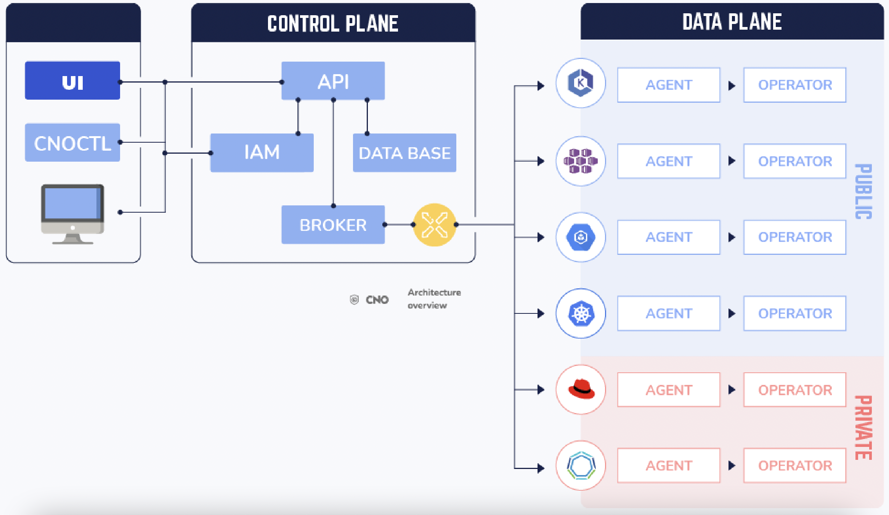

# CNO, Cloud Native Onboarding.
Onboard, Deploy, Manage and Secure microservices on Kubernetes.

CNO (Cloud Native Onboarding) is an open source platform to onboard easily and securely development teams on multi-cloud Kubernetes clusters from a single console.

* [Why CNO](#why-cno)
* [Get Started](#quick-installation)
* [Architecture and components](#architecture-overview-and-cno-components))
* [Quick Installation](#quick-installation)
* [Add a new cluster into CNO HUB](#add-a-new-Kubernetes-or-openshift-cluster-into-cno-hub)

# Supported Platforms

1. Amazon Elastic Kubernetes Service (EKS)
2. Google Kubernetes Engine (GKE)
3. Azure Kubernetes Service (AKS)
4. RedHat Hat OpenShift container Platform
5. VMWARE Tanzu
6. Rancher
7. Any other kubernetes distribution

# Why CNO

In 2021, running a Kubernetes or OpenShift cluster has never been easy.  It's possible to bootstrap a Production Cluster on any platform in a few minutes. But most companies still struggle to know the best way to onboard all teams and are not really taking advantage of Kubernetes ecosystem. A well executed and secured Cloud Native platform project can offer an ROI up to 531%.
CNO is built on the idea of filling the gap of adoption and avoid mistakes by:
- Setting up the best onboarding process for your existing teams and ecosystem
- Hiding Kubernetes complexity
- Managing from a single console your multi-cloud Kubernetes clusters
-  Taking advantages of Kubernetes and DevOps by going faster to Production with deployments advanced strategies like Blue Green and Canary
-  Leveraging Visibility and centralized management into your IAM strategy
- Ensuring that your clusters are compliant to your Standards and Governance Policies

# Architecture overview and CNO components


CNO is an open source project mainly composed of 8 modules.
1. CNO Console
2. CNO API
3. CNO CLI (cnoctl)
4. CNO Agent installed in each kubernetes Clsuter
5. CNO OpenShift Operators
6. CNO CD Operators
7. CNO Kubernetes Operators
8. CNO Notification


# Quick Installation

## Prerequisites

Kubernetes **v1.16** or higher is supported by CNO.

**Important** Make sure your kubectl CLI is correctly configured. If you need help to configure Kubernetes environnement, follow [kubectl configuration documentaion](configure-kube.md).

**Important** If you are a beginner and don't have a Kubernetes cluster ready to use, you can follow [Bootstrap kubernetes Cluster on any cloud provider in 1 minute](bootstrap-kube.md) documentaion.


#### Define your Ingress Controller multidomain.


```
export INGRESS_DOMAIN=apps.example.com
```
If your INGRESS_DOMAIN is **apps.example.com**, CNO will create **cno.apps.example.com** ingress ressource.

Your Ingress Controller needs to support SSL passthrough. Most Ingress controllers (NGINX, OpenShift Router and Traefic) support SSL passthrough. Make sure that SSL passthrough parameter is activated in your Kubernetes Ingress Controller or OpenShift Router.

**Important** If you are a beginner and don't have an ingress controller in your Kubernetes  cluster ready to use, you can follow [Install NGINX INGRESS Controller](bootstrap-ingress.md) documentaion.

##### AWS Elastic Kubernetes Service (EKS) and Azure Kubernetes Service (AKS)

If you installed CNO in a Kubernetes clsuter with PSP (Pod Security Policy) activated such as EKS and AKS, run the following command.

```
export CNO_POD_POLICY_ACTIVITED=true
```

### Install CNO

```
export CNO_VERSION=main
curl -sSL https://raw.githubusercontent.com/beopencloud/cno/$CNO_VERSION/scripts/control-plane/install.sh | sh
```

####  Enjoy

You can login to your CNO console via cno.$INGRESS_DOMAIN.
You will see CNO UI URL and credentails.

```
============================================================
  INFO CNO installation success.
     cno.apps.example.com  CNO Credentials USERNAME: admin    PASSWORD: xxxxxxxxxxxxxxxx
     cno-auth.apps.example.com credentials: USERNAME: admin       PASSWORD: xxxxxxxxxxxxxxxxx

============================================================
```

Now you can start onboarding your IT teams, projects and any add Kubernetes cluster.

# Add a new Kubernetes or OpenShift cluster into CNO Hub

1. In the CNO Console, navigate to the clusters page.
2. Select Add Cluster.
3. Enter a name for the cluster.
4. Enter the cluster type (***EKS, AKS , GKE, Kubernetes or OpenShift***) and click on Add Cluster
5. Copy outpout commands and install CNO agent is your new cluster.
